# Data Prioritization System for Appointments

## Overview

The appointments page now implements a smart data prioritization system that **prioritizes live API data** over sample data, using sample data only as a fallback when necessary.

## How It Works

### Data Source Priority
1. **🎯 Primary**: Live API data from the appointment service
2. **🔄 Fallback**: Sample data (only when API fails or returns empty)
3. **📊 Transparent**: Clear indicators show which data source is active

### Data Flow

```mermaid
flowchart TD
    A[Component Loads] --> B[Fetch from API]
    B --> C{API Success?}
    C -->|Yes| D{Data Available?}
    C -->|No| E[Show Sample Data]
    D -->|Yes| F[Show API Data]
    D -->|No| G[Show Sample Data with Warning]
    F --> H[✅ Live Data Badge]
    E --> I[⚠️ Sample Data Badge]
    G --> I
```



## User Interface Indicators

### Data Source Badges
- **🟢 Live Data**: API connection successful, showing real data
- **🟡 Sample Data**: Using fallback data (API unavailable or empty)
- **🔵 Loading...**: Currently fetching data

### Refresh Button
- Manual refresh to retry API connection
- Animated loading state during refresh
- Attempts to reconnect to API when clicked

### Error Notifications
- **API Connection Failed**: Shows when backend is unreachable
- **Empty Data Warning**: Shows when API returns no appointments
- **Success Messages**: Confirms when API data loads successfully

## Technical Implementation

### State Management
```typescript
const [dataSource, setDataSource] = useState<'api' | 'fallback' | 'loading'>('loading');
const [apiError, setApiError] = useState<string | null>(null);
```

### Data Fetching Logic
```typescript
const fetchAppointments = useCallback(async (showToast = true) => {
  try {
    const data = await getAppointments();
    if (data && data.length > 0) {
      // ✅ Use API data (preferred)
      setAppointments(data.map(fromDTO));
      setDataSource('api');
    } else {
      // ⚠️ API returned empty, use fallback
      setAppointments(initialAppointments);
      setDataSource('fallback');
    }
  } catch (error) {
    // ❌ API failed, use fallback
    setAppointments(initialAppointments);
    setDataSource('fallback');
    setApiError(error.message);
  }
}, []);
```

### CRUD Operations Synchronization

The system intelligently handles data synchronization:

#### When Using API Data (dataSource === 'api')
- **Create**: Refreshes from API to get updated data
- **Update**: Refreshes from API to stay in sync
- **Delete**: Refreshes from API to reflect changes

#### When Using Fallback Data (dataSource === 'fallback')
- **Create**: Updates local state only
- **Update**: Updates local state only  
- **Delete**: Updates local state only

## Benefits

### For Users
- **🎯 Always Current**: Real data when available
- **🔄 Graceful Degradation**: Continues working when API is down
- **👁️ Transparency**: Clear indication of data source
- **🔄 Manual Recovery**: Refresh button to retry connections

### For Developers
- **🛠️ Easy Testing**: Sample data available for development
- **🐛 Better Debugging**: Clear error messages and state tracking
- **📈 Monitoring**: Know when API issues occur
- **🔧 Maintenance**: Can deploy frontend independently of backend

## Error Scenarios Handled

### 1. Backend Service Down
```
❌ API Connection Failed
Could not connect to appointment service: Network Error. 
Showing sample data for demonstration.
```

### 2. Empty Database
```
⚠️ Using Sample Data
API returned no appointments, showing sample data for demonstration.
```

### 3. Authentication Issues
```
❌ API Connection Failed
Could not connect to appointment service: 401 Unauthorized. 
Showing sample data for demonstration.
```

### 4. Network Issues
```
❌ API Connection Failed
Could not connect to appointment service: Request timeout. 
Showing sample data for demonstration.
```

## Configuration

### Sample Data
The fallback data is defined in `initialAppointments.ts` with complete appointment records including all required fields:

```typescript
export const initialAppointments: Appointment[] = [
  {
    id: 1,
    patientName: "Cara Stevens",
    doctorId: 1,
    doctor: "Dr.Rajesh",
    // ... other fields
    patientId: 101,
  },
  // ... 20 sample appointments
];
```

### API Configuration
```typescript
// Base URL configured in api.ts
baseURL: 'http://localhost:8080'

// Appointment endpoints
GET /appointments           // Get all appointments
POST /appointments          // Create appointment
PUT /appointments/{id}      // Update appointment
DELETE /appointments/{id}   // Delete appointment
```

## Testing the System

### 1. Test API Priority
1. Start the backend appointment service
2. Navigate to appointments page
3. Should show green "Live Data" badge
4. Create/edit/delete appointments - changes sync with backend

### 2. Test Fallback Behavior
1. Stop the backend service
2. Refresh the appointments page
3. Should show amber "Sample Data" badge with error notice
4. Can still interact with sample data

### 3. Test Recovery
1. Start the backend service again
2. Click the "Refresh" button
3. Should reconnect and show "Live Data" badge

## Future Enhancements

### Automatic Retry
```typescript
// Could add automatic retry with exponential backoff
const retryFetch = async (retries = 3, delay = 1000) => {
  for (let i = 0; i < retries; i++) {
    try {
      return await fetchAppointments();
    } catch (error) {
      if (i === retries - 1) throw error;
      await new Promise(resolve => setTimeout(resolve, delay * Math.pow(2, i)));
    }
  }
};
```

### Offline Detection
```typescript
// Could add offline/online detection
useEffect(() => {
  const handleOnline = () => fetchAppointments(true);
  window.addEventListener('online', handleOnline);
  return () => window.removeEventListener('online', handleOnline);
}, []);
```

### WebSocket Real-time Updates
```typescript
// Could add real-time updates when other users modify data
const wsConnection = new WebSocket('ws://localhost:8080/appointments/updates');
wsConnection.onmessage = (event) => {
  const update = JSON.parse(event.data);
  handleRealtimeUpdate(update);
};
```

This system ensures that users always have access to appointment data, with clear indicators of data freshness and the ability to recover from temporary connectivity issues. 